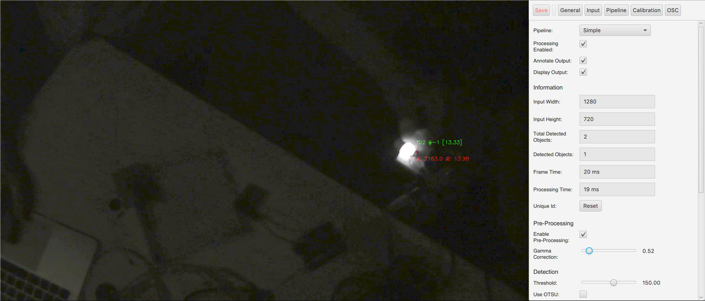

# IR Tracking System
This project aims to create an infrared tracking system for tactile tables.


*Tracking application detecting a single tactile object.*

### Develop

#### Install and Run
Everything is installed through the [gradle](https://gradle.org/) dependency manager. To run the application, OpenJDK 11 is needed and can be installed through your favourite package manager. On MacOS we recommend to use [brew](https://brew.sh/):

```bash
brew cask install java
```

Now just run the following command and gradlew will download, build and run the project.

```bash
# windows
gradlew.bat run

# macOS / unix
./gradlew run
```

### Build for Distribution
To bundle all dependencies and build the project run the following commands. This will take a bit of time because JavaCV will be added to the jar-file.

```bash
# windows
gradlew.bat fatJar

# macOS / unix
./gradlew fatJar
```

The built jar is runnable on all platforms (includes all dependencies).

### How to use

#### Example
To connect with the IR tracking system it is possible to listen to predefined OSC messages. There is already a `TrackingClient` written for Processing to connect with the tracking application. Check out the [ExampleReceiver](https://github.com/IAD-ZHDK/IR_tracking/tree/master/examples/ExampleReceiver) sketch.

#### OSC Protocol
The OSC protocol sends out events which are need for the visualisation. It already normalizes and filters the values.

```java
// Add is sent if a new object is detected.

"/tracker/add"
	- uniqueId (int) // unique number
	- identifier (int) // object type
	- x-coordinate (float) // normalized
	- y-coordinate (float) // normalized
	- rotation (float) // between 0.0-180.0
	- intensity (float) // normalized
```


```java
// Every n millisecond an update is sent for each active object.

"/tracker/update"
	- uniqueId (int) // unique number
	- identifier (int) // object type
	- x-coordinate (float) // normalized
	- y-coordinate (float) // normalized
	- rotation (float) // between 0.0-180.0
	- intensity (float) // normalized
```

```java
// Remove is sent if an object is not detected anymore.

"/tracker/remove"
	- uniqueId (int) // unique number
```

### About
Developed at [Zurich University of the Arts ZHdK](https://www.zhdk.ch/) 2019
